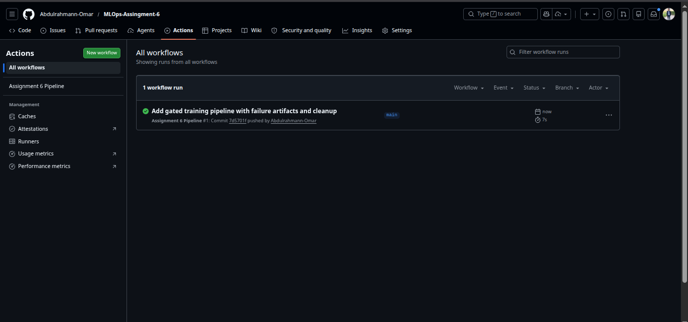

# MLOps Assignment 6

## Implementation Summary

This repository includes a GitHub Actions pipeline at `.github/workflows/pipeline.yaml` with strict gatekeeper logic for the expensive `train` job.

### Gatekeeper Conditions for `train`

The `train` job runs only when **all** of the following are true:

1. `linter` job passed (`needs: linter`)
2. Branch is `main`
3. Commit message contains `[run-train]`

### Failure Handling

If `train` fails:

- A failure-only step (`if: failure()`) creates `error_logs.txt`
- `error_logs.txt` is uploaded as a GitHub Actions artifact

### Always Cleanup

The final cleanup step always runs (`if: always()`) and prints:

`Cleaning up temporary cloud volumes...`

## Final Pipeline File

- `.github/workflows/pipeline.yaml`

## GitHub Actions Screenshots

### Screenshot 1

### Screenshot 2

### Screenshot 3

### Screenshot 4

